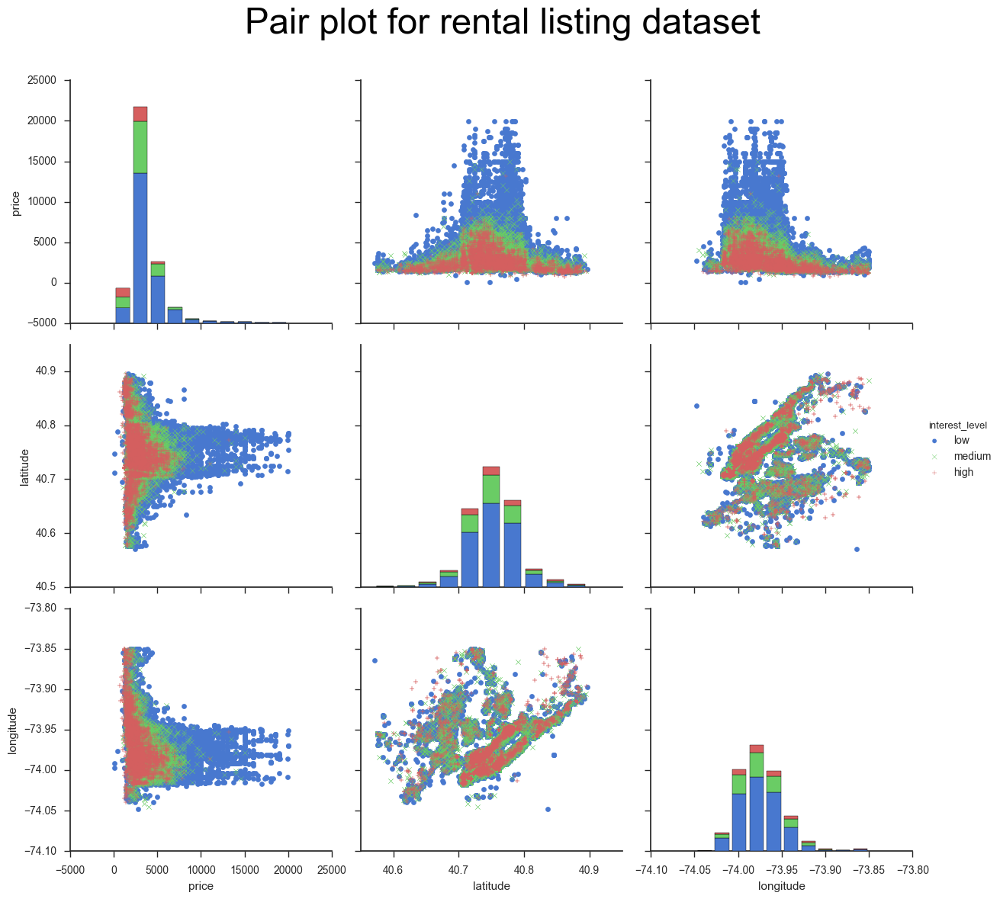

# NYC rental listing data
Interest level predictor for a given rental listing.

## Introduction
This is an open-ended project for the Data Science program at [K2 Data Science](http://k2datascience.com).

Rental Listing Dataset from Kaggle competition [Two Sigma Connect: Rental Listing Inquiries](https://www.kaggle.com/c/two-sigma-connect-rental-listing-inquiries) was chosen. This competition gives a rental listing dataset in NYC and its surroundings.

Each listing gives following information
1.  Date of listing correlation
2.  Number of bathrooms
3.  Number of bedrooms
4.  Building_id
5.  Description of rental property
6.  Display_address
7.  List of features about this apartment
8.  Geo location (latitude, longitude)
9.  A list of photos of the rental property
10. Price: in USD
11. Street address
12. Interest_level that this listing generated. It    has     categories: 'high', 'medium' and 'low'

## Goals
The goal of Kaggle competition is to predict the interest level based on information from rental listing. In this project, the training dataset was used to explore the connection between various aspects, mostly numerical data, of rental listing information to interest level. Based on the exploration, few simple rule based interest level predictors were developed and their predictability was assessed and compared. A portion of the training set was used to build the predictive algorithm and rest of the data was used to test the prediction algorithm. Kaggle's scoring metric to test the efficacy of algorithm.

In addition to exploring the dataset provided by Kaggle, the connection between distance to closest subway station from a given rental property and its correlation to either rental price and/or interest level for that rental listing was also explored. Towards that purpose, a dataset containing list of all Subway-Stationsa with their corresponding geo-locations was used.

## Assumptions
Each rental listing has numerical data such as price, number of bedrooms, number of bathrooms, geo-location. It also has text data such as list of features, rental property description and images of the property. A more thorough and rigorous interest level predictor would use numerical, text and image data in a complementary fashion. However, in this project only numerical data was used.

## Approach
Rental listing dataset used here was provided by [Kaggle Two-Sigma competition](https://www.kaggle.com/c/two-sigma-connect-rental-listing-inquiries/data). The data is in .json format. The dataset was loaded using [Pandas](http:''pandas.pydata.org) package and the resulting dataframe was explored by various standard EDA techniques such as plotting, generating tables and counting entries categorically. The dataset provided did not need extensive cleaning. However, additional columns such as month, date of listing and distance to closest subway were estimated separately. Closest subway distance was estimated by using [subway station geolocation data](https://nycopendata.socrata.com/Transportation/stations/h7ab-a3zr/data) downloaded in .csv format. Python's geopy module was used to measure distance between two loaction with geo-coordinates as input.
## Rental Listing Dataset Exploration
Independent fields of the dataset are
1.  Date of listing correlation
2.  Number of bathrooms
3.  Number of bathrooms
4.  Building_id
5.  Description of rental property
6.  Display_address
7.  List of features about this apartment
8.  Geo location (latitude, longitude)
9.  A list of photos of the rental property
10. Price: in USD
11. Street address

The challenge is to predict the interest level that a given rental listing generates. Most common questions, based on real life experiences, one would ask could be as follows
1. is the interest level location dependent?
2. is it highly correlated with rental price?
3. is it correlated with number of bedrooms and bathrooms?
4. is rental price correlated with distance to closest subway station?
5. what is most simplistic interest level prediction algorithm?. How effective is it? How can it be improved?

In order to answer the questions posed above, exploratory data analysis was performed on rental dataset while using geo-locational database of subway station as supplementary information.

### Basic Counting
The dataset provided by Kaggle has a total of 49,352 entries. If the data was grouped by interest level, about 69.5% of rental listings have low interest and only ~8% of listings have high interest. It could be pointed out that the rental listings in NYC have low interest level in general. Kaggle competition wants the participants to predict the probabilities for a listing to have low, medium and high interest levels. Most quickest and coarsest prediction would be to assign prob_low = number of listings with low interest/total number of entries and so on. To be more accurate, with the prediction, correlation between various aspects of the rental listing and interest_level have to be explored and factored in the prediction.
### Exploring features of rental listing
Each rental listing has features that could be categorized as numerical, text and image data. This exploratory data analysis is solely focused on correlating numerical data with interest level and attempts to develop a algorithm that predicts probabilities of interest level.
#### Just Rental Price
It seems fair to say that houses with lower rental price might show higher interest level and vice versa. Box plots seemed to natural choice to explore this aspect of the dataset.

Median rental prices of high interest level houses are lower than houses with medium interest level which are lower than low interest level category. However, the inter-quartile ranges of these three categories overlap significantly. This makes interest level prediction solely based on rental price ineffective approach.
Above box plot does not show any outliers. There are about 2215 listings out of 49,352 listings which have rental prices more than 7000$. Of these 95% of listings showed lower interest level.
#### Price and Location
Features that have numerical data are number of bedrooms, number of bathrooms, price, latitude and longitude. Since number of bed and bathrooms take discrete values, it might be worth while to look at pair-plot with price, latitude and longitude as variables, shown below

Plots suggest that space in price-latitude and price-longitude domain could be partitioned into regions that have very high probability for
  1. low interest
  2. either medium or low interest
  3. showing high interest listings

#### Bedrooms and bathrooms    
Cross correlation table was developed between bathrooms and interest level, shown below

Listings with number of bathrooms other than one or two have more than 90% probability for low interest level. However, 80% of listings have one bathroom and 16% have 2 bathrooms.  Following two table shows the interest level of one and two bathroom rental listings by number of bedrooms.

##### one bathroom listings

##### two bathroom listings

 Listings with one bedroom and one bath tops number of rental listings. Category that shows highest fraction of high interest level listings have two bedrooms and one bathroom.
 Classification of data by combination number of bedrooms and number of bathrooms did show that interest level depends on number of bedrooms and bathrooms.

#### What about proximity to Subways?
Subway is one of the preferred modes of transportation in NYC. It seems intuitive/obvious to expect a correlation between rental price and distance to closest subway.

Figure below plots distance to closest subway vs price

There is no clear correlation between price and distance to nearest subway. However, scaled rental price (scaled price = price/(number of bathrooms)/(distance to subway)) shows exponential correlation with distance, see below.

Log-log plot, shown below, indicates that scaled price could be bound between two lines in log-log space.

### Interest Level prediction
Based on exploratory analysis, three algorithms for predicting interest level were developed. 60% of the dataset was used for training while rest of 40% data was used for prediction.

1. Basic Algorithm:- probabilities of low interest level = fraction of low interest level listings of total listings in training set and so on. Kaggle established logloss metric, described below. According to this metric, this algorithm gives a value of 0.792, resulting in about 94.719% correct prediction. Perfect prediction would give a metric value of 0.0.

2. Bedroom and Bathroom Algorithm:- This algorithm used number of bedrooms and bathrooms as independent variable inputs of predictive function. For example, probability of low interest level for listing with 'x' bedrooms and 'y' bathrooms= fraction of low interest level listings in training set with 'x' bedrooms and 'y' bathrooms among all listings in training set with 'x' bedrooms and 'y' bathrooms. According to this metric, this algorithm gives a value of 0.781, resulting in about 94.8% correct prediction.

3. Bedroom, Bathroom, Price and Location based Algorithm:- This algorithm used number of bed and bathrooms, price and location (latitude, longitude) using fractional counting procedure similar to 'Bedroom and Bathroom Algorithm'.This algorithm gives a metric of 0.757, resulting in about 95% of correct predictions.

Algorithms described above were of increasing complexity and definitely showed some improvement in their predictability. However, improvement was limited and points out that prediction algorithm needs to exploit text and image information also.

## Summary
IN this EDA project, rental listing dataset provided by Kaggle was used. Correlation between numerical data of rental listing and interest level was explored and three rule-based prediction algorithms with increasing level of complexity were developed. However, it is evident that text and image data also should be used to get better predictive algorithm.

## Appendix
The code used for exploratory data analysis plots along with interest level prediction algorithm are in Rental_price_predict.ipynb. Price and distance-to-subway correlation was coded in Rental_price_Corellation.ipynb
